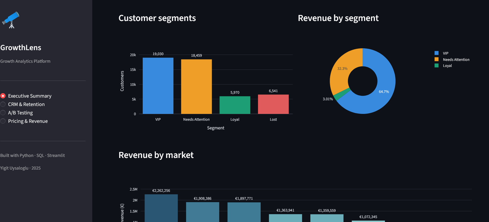
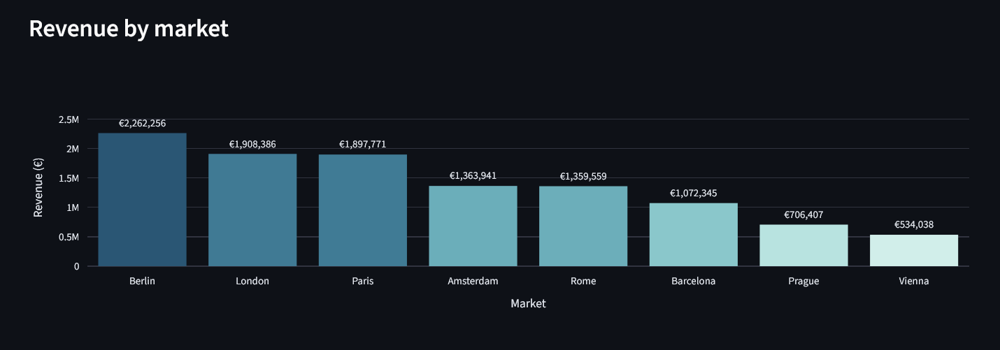
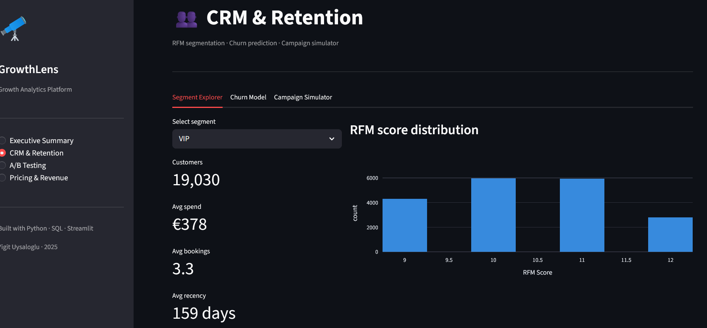
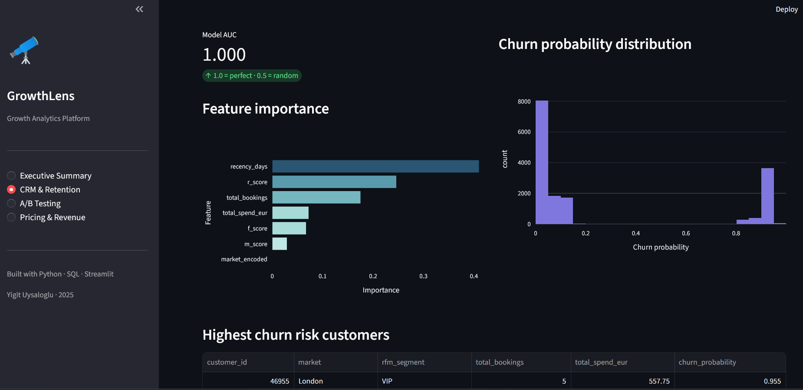
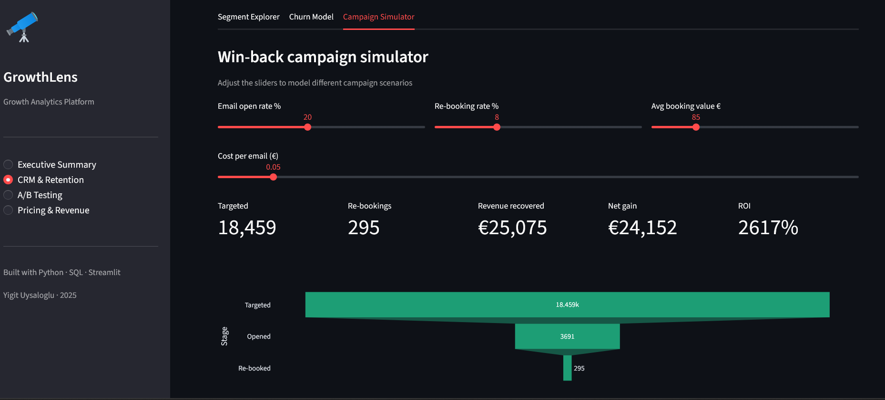
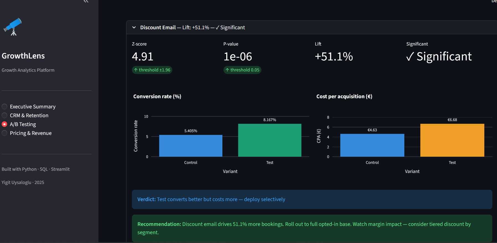
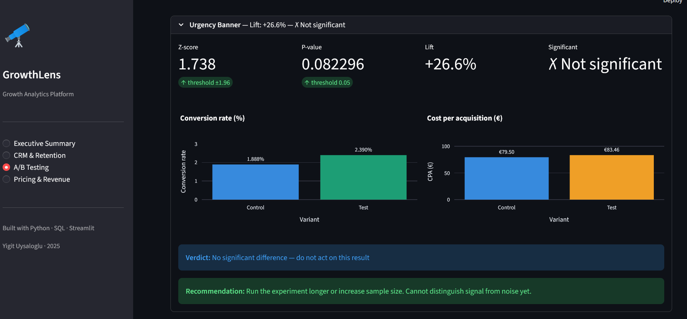
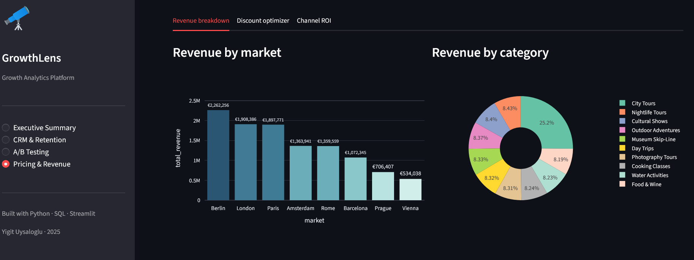
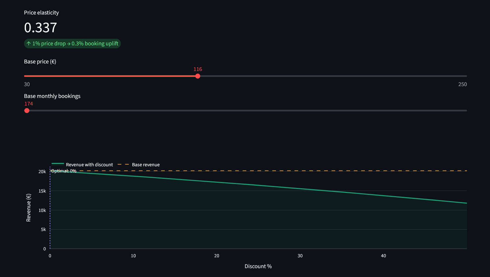
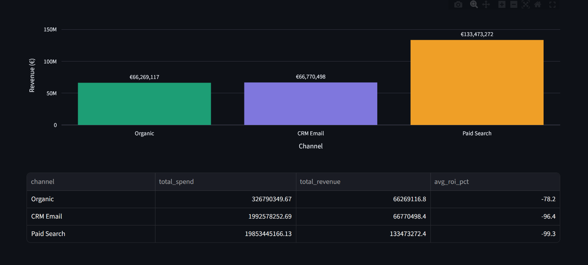

# 🔭 GrowthLens

**End-to-end growth analytics platform covering the full acquisition → retention → monetization loop.**

Built to demonstrate real-world data science skills: SQL analytics, machine learning, statistical testing, and interactive dashboards — all connected through a single synthetic travel marketplace dataset.

📊 **[GitHub](https://github.com/Yigituysgl/GrowthLens)** · Built with Python · SQL · Streamlit

---

## The Business Problem

A travel marketplace (think GetYourGuide, Airbnb Experiences) needs to answer three questions every week:

1. **Who are our customers and which ones are at risk of leaving?** → CRM & Retention
2. **Did our last marketing experiment actually work?** → A/B Testing
3. **Are we pricing our experiences optimally?** → Pricing & Revenue

GrowthLens answers all three in one platform.

---

## Dashboard Screenshots

### 📊 Executive Summary



### 👥 CRM & Retention




### 🧪 A/B Testing



### 💰 Pricing & Revenue




---

## What's Inside

### 👥 CRM & Retention
- **RFM segmentation** of 50,000 customers using SQL window functions (`NTILE`, `JULIANDAY`, CTEs)
- **Churn prediction** with Random Forest — identifies customers most likely to stop booking
- **Interactive campaign simulator** — drag sliders to model win-back email ROI in real time
- Segments: VIP · Loyal · Needs Attention · At Risk · Lost

### 🧪 A/B Testing
- **Z-test engine** built from scratch using `scipy.stats`
- Tests two live experiments: urgency banner vs discount email campaign
- Outputs: Z-score, p-value, lift %, CPA comparison, plain-English business recommendation
- Correctly identifies one experiment as **significant** and one as **not significant**

### 💰 Pricing & Revenue
- **Price elasticity modeling** from month-over-month booking and price data
- **Discount optimizer** — simulates revenue at every discount level (0–50%)
- Revenue breakdown by market and category
- Channel ROI comparison: Paid Search vs CRM Email vs Organic

---

## Key Findings

- **19,030 VIP customers** (38% of base) generate **64.7% of total revenue** — but last booked 159 days ago → churn risk
- **Discount email**: Z=4.91, p<0.001 → significant, +51% lift — but CPA rises €4.63→€6.68 (deploy selectively)
- **Urgency banner**: Z=1.738, p=0.082 → not significant — do not ship, run longer
- **Price elasticity = 0.34** → customers are inelastic; deep discounting hurts revenue
- **6,541 customers** signed up but never booked → onboarding failure, not churn

---

## Tech Stack

| Layer | Tools |
|-------|-------|
| Database | SQLite · DBeaver |
| SQL | CTEs · Window functions · NTILE · JULIANDAY · COALESCE |
| Python | pandas · numpy · scikit-learn · scipy · plotly |
| Dashboard | Streamlit |
| ML | Random Forest (churn) · Price elasticity model |
| Stats | Z-test for proportions · AUC evaluation |
| DevOps | Git · GitHub |

---

## Project Structure

```
GrowthLens/
├── app.py                        # Streamlit dashboard (4 pages)
├── requirements.txt
│
├── modules/
│   ├── data_generator.py         # Generates 50K customers + 95K bookings
│   ├── crm_retention.py          # RFM + churn model + campaign ROI
│   ├── ab_testing.py             # Z-test engine for A/B experiments
│   └── pricing_opt.py            # Elasticity model + discount optimizer
│
├── sql/
│   ├── rfm_segmentation.sql      # CTE chain: base → scores → segments
│   ├── ab_testing.sql            # Experiment aggregation by variant
│   ├── pricing_analysis.sql      # Revenue by month/market/category
│   └── marketing_roi.sql         # Channel spend vs revenue
│
└── screenshots/                  # Dashboard screenshots
```

---

## The Data

| Table | Rows | Description |
|-------|------|-------------|
| `customers` | 50,000 | Demographics, market, segment, email opt-in |
| `bookings` | 95,754 | History across 8 markets, 10 categories, 3 channels |
| `experiments` | 18,000 | Two A/B tests with built-in conversion signals |
| `marketing_spend` | 576 | Monthly spend by market and channel |

---

## Run Locally

```bash
git clone https://github.com/Yigituysgl/GrowthLens.git
cd GrowthLens
python -m venv venv
source venv/bin/activate  # Windows: venv\Scripts\activate
pip install -r requirements.txt
python modules/data_generator.py
streamlit run app.py
```

---

## About

Built by **Yigit Uysaloglu** — Data Scientist based in Berlin.

MSc in Data Analytics · Berlin School of Business and Innovation · 2026

[](https://linkedin.com/in/yigit-uysaloglu)
[](https://github.com/Yigituysgl)
