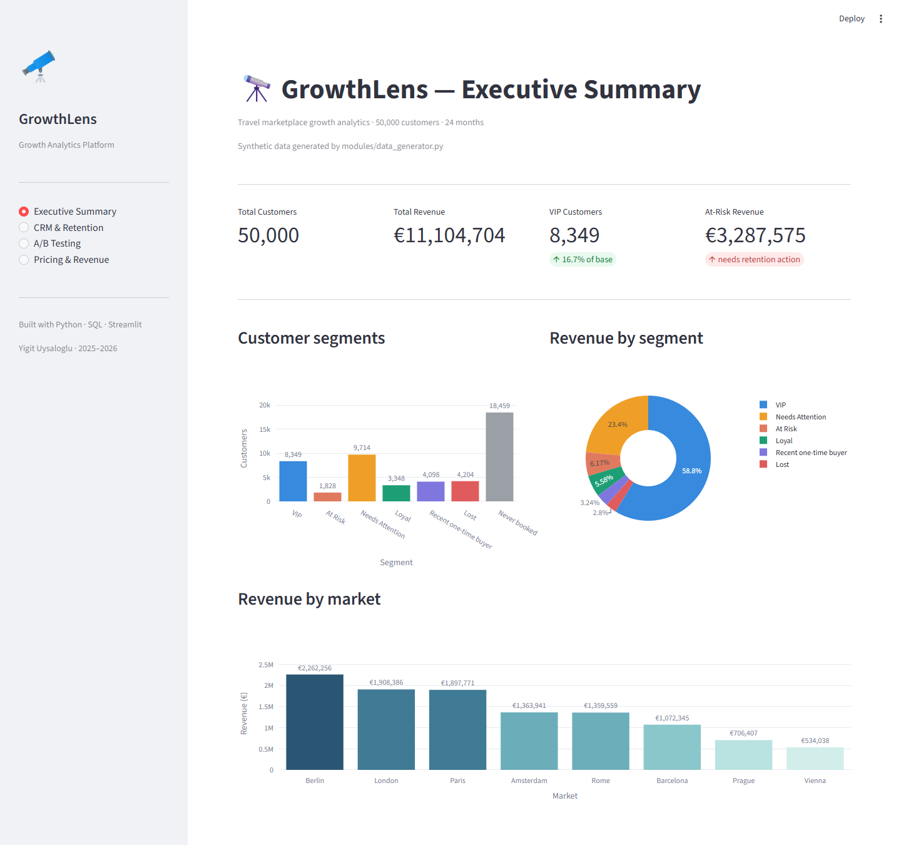
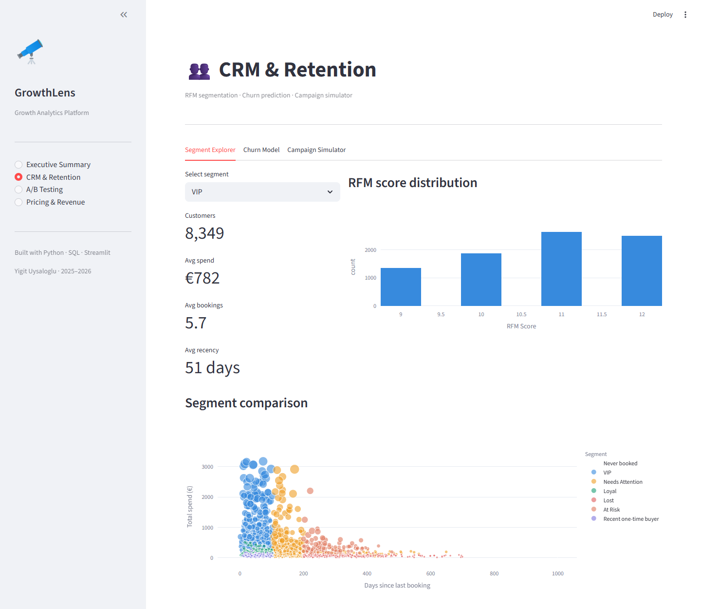
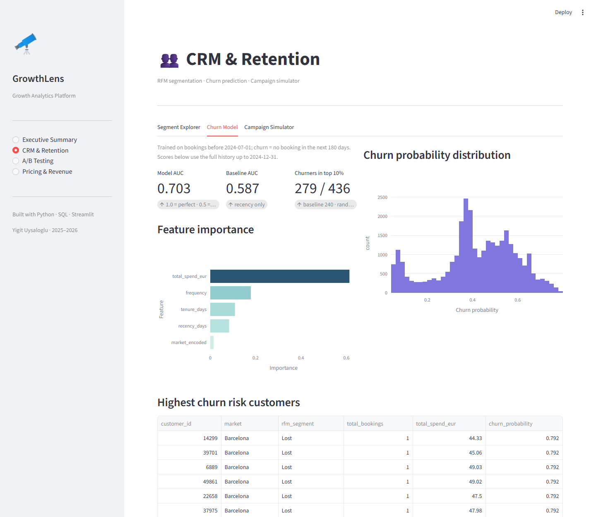
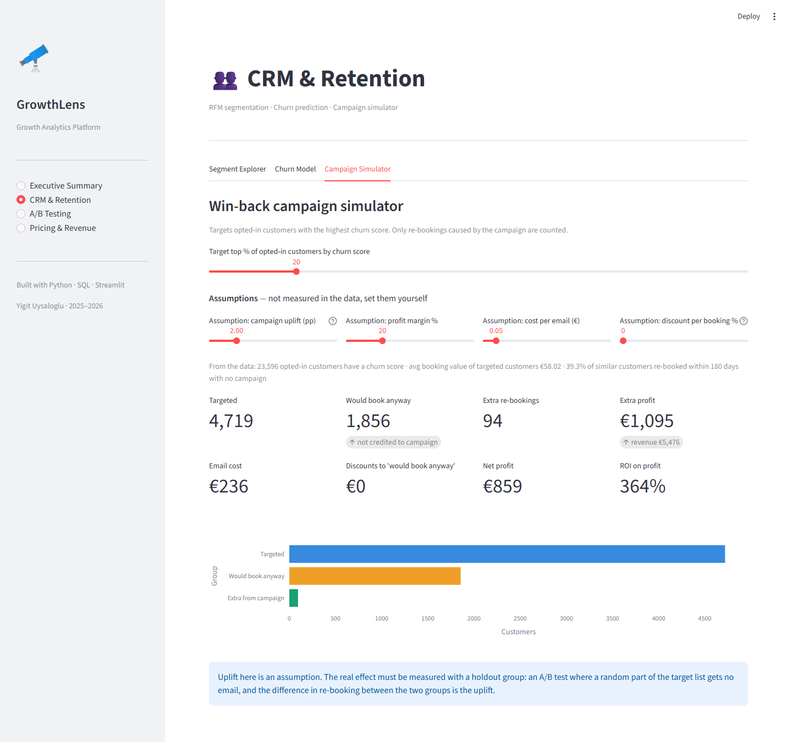
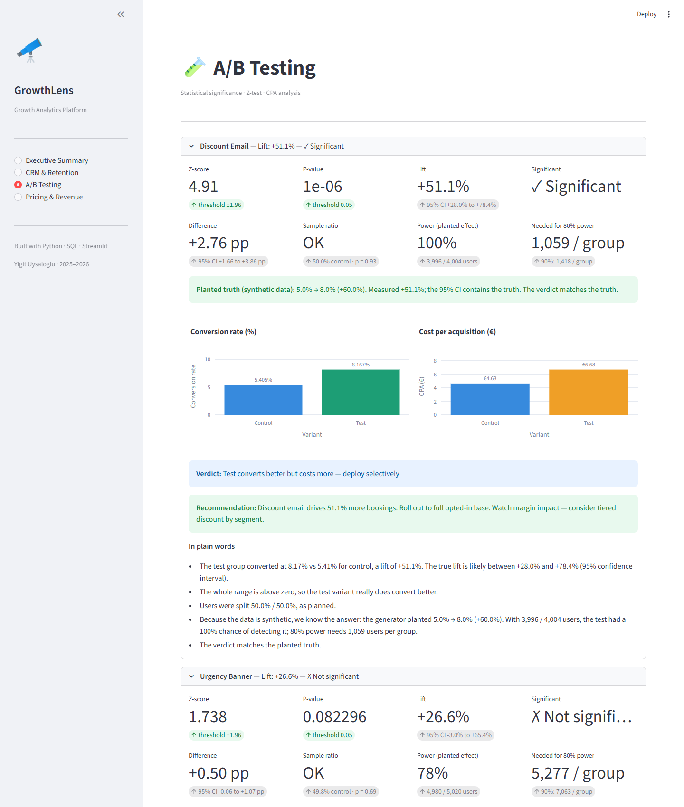
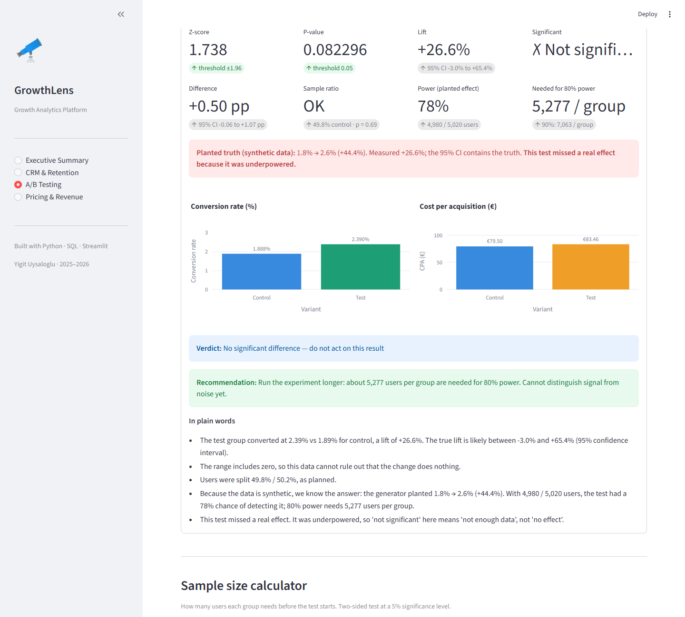
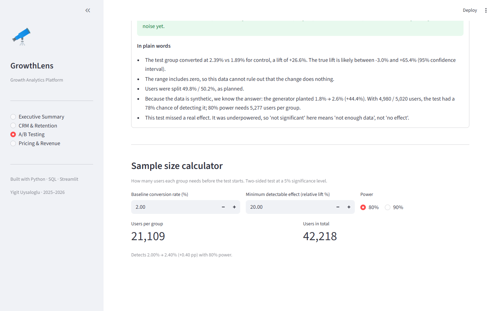
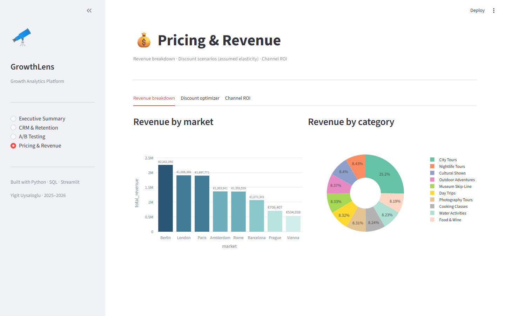
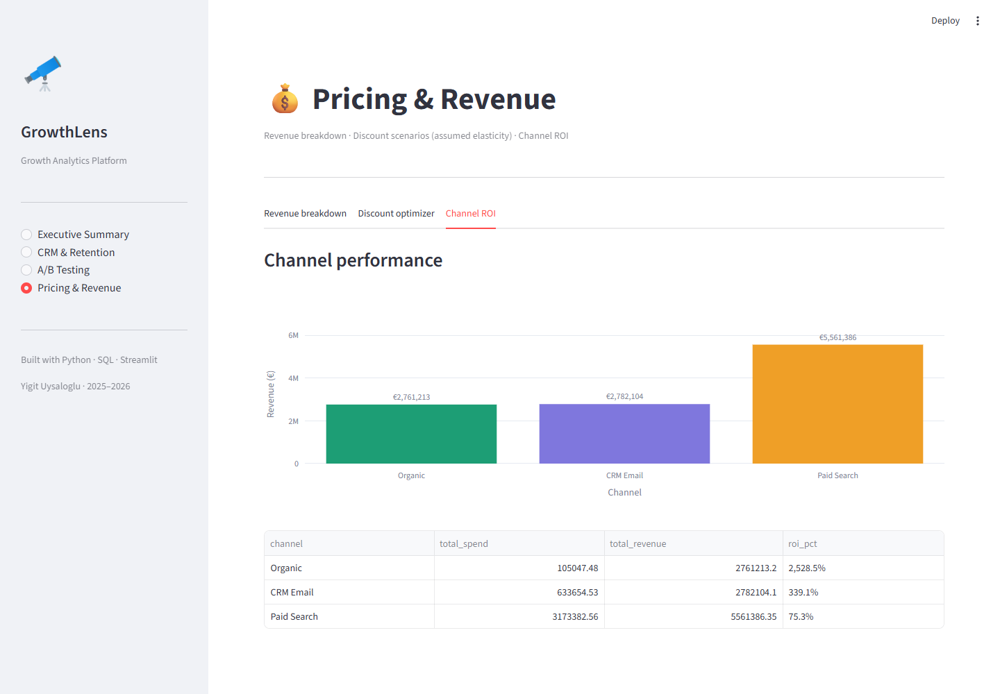
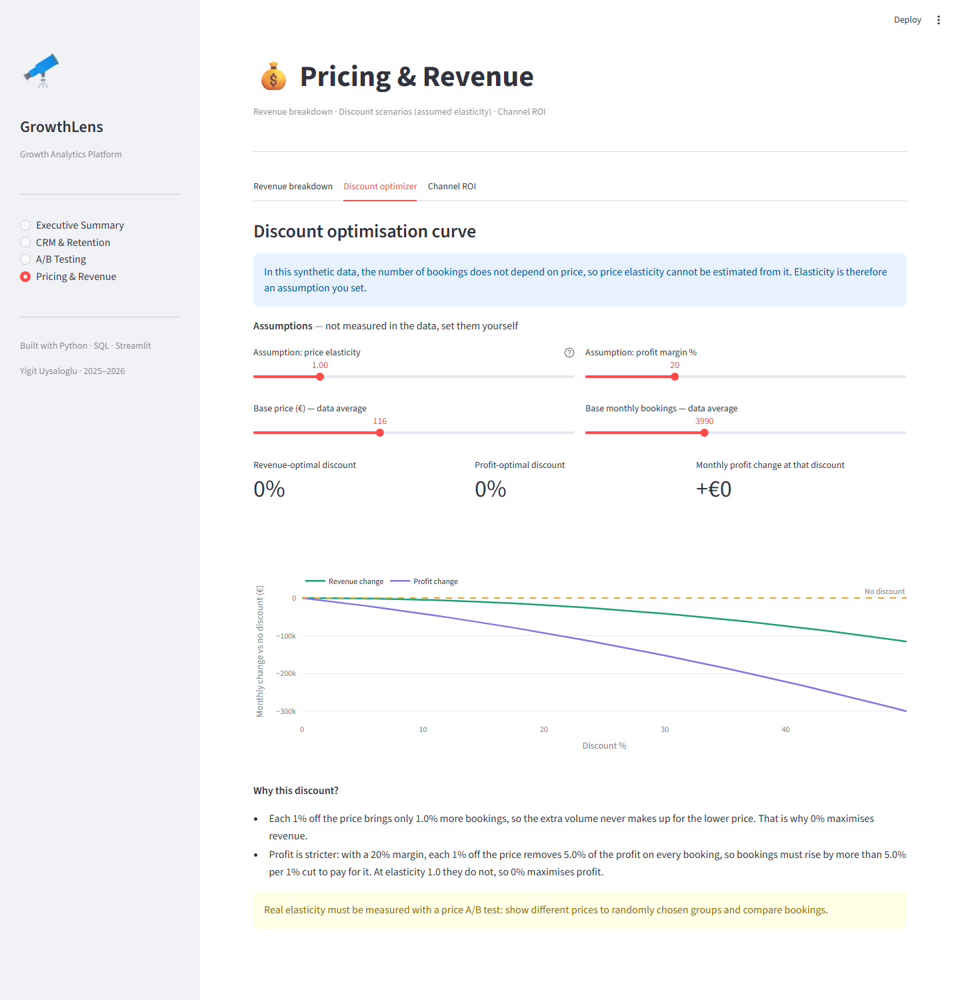

# 🔭 GrowthLens

[](https://github.com/Yigituysgl/GrowthLens/actions/workflows/tests.yml)

**A growth analytics dashboard for a travel marketplace: who the customers are, who is likely to stop booking, whether experiments really worked, and what marketing and discounts are worth.**

Built with Python · SQL · Streamlit

---

## About the data — read this first

**All data in this project is synthetic.** It describes a made-up marketplace for tours and activities in eight European cities, generated by a Python script ([`modules/data_generator.py`](modules/data_generator.py)):

| Table | Rows | What it holds |
|-------|------|---------------|
| `customers` | 50,000 | Sign-up date, market, email opt-in |
| `bookings` | 95,754 | Bookings from January 2023 to December 2024, with price, category and channel |
| `experiments` | 18,000 | Two A/B tests: an urgency banner and a discount email |
| `marketing_spend` | 576 | Monthly spend per market and channel |

**Why that is useful:** because we wrote the generator, we know the true answers. For example, we planted a real effect in both A/B tests. That lets us check whether each method finds the truth, and say plainly where it does not. It also means some questions cannot be answered from this data at all; each section below says so where it matters.



---

## 1. Customer segments (RFM)

**What it does.** Sorts customers into groups by how **R**ecently they booked, how **F**requently, and how much **M**oney they spent. Recency and spend are scored in quarters among customers who have booked. Frequency uses booking counts (1, 2, 3–4, 5+), because most customers booked only once and quarters cannot split them. Customers who never booked get their own group instead of distorting the scores.

**What we found.**

| Segment | Customers | Share of customers | Share of revenue | Avg. days since last booking |
|---|---:|---:|---:|---:|
| VIP | 8,349 | 16.7% | 58.8% | 51 |
| Needs Attention | 9,714 | 19.4% | 23.4% | 178 |
| At Risk | 1,828 | 3.7% | 6.2% | 284 |
| Loyal | 3,348 | 6.7% | 5.6% | 55 |
| Recent one-time buyer | 4,098 | 8.2% | 3.2% | 56 |
| Lost | 4,204 | 8.4% | 2.8% | 347 |
| Never booked | 18,459 | 36.9% | 0% | — |

- One in six customers (the VIPs) brings in almost 60% of revenue, and they booked recently.
- More than a third of sign-ups (18,459) never booked at all: an onboarding question, not a retention one.

**Limitations.** The segment rules are a fixed recipe, not learned from data, and the cut-offs are choices. Recency is measured against the last day of the data (31 December 2024). The segments only partly match the hidden customer groups the generator uses: of the customers RFM calls VIP, 37% come from the generator's VIP group and 51% from its Regular group.



---

## 2. Churn model

**What it does.** Predicts which customers will not book again in the next 180 days. It is trained the way it would be used in practice: the model only sees bookings before 1 July 2024 (recency, frequency, spend, tenure, market) and is graded on what actually happened in the 180 days after. A test checks that no input uses data from after that date.

**What we found.** 21,775 customers had booked before 1 July 2024; 40.7% of them did not book in the following 180 days. On 4,355 customers the model never saw:

| | Random Forest | Simple rule: "longest since last booking" |
|---|---:|---:|
| AUC (0.5 = guessing, 1.0 = perfect) | **0.703** | 0.587 |
| Real churners among the 436 riskiest (top 10%) | **279** | 240 |

Picking 436 customers at random would catch about 178 churners. The strongest signals are past spend and booking frequency.

**Limitations.** Accuracy is moderate. The generator has no real churn mechanism: each customer books at a fixed random rate, so "churn" here mostly means a low booking rate plus chance. The model is evaluated at one cutoff date only.



---

## 3. Win-back campaign simulator

**What it does.** Estimates whether emailing the customers most likely to churn pays off. It targets only customers who opted in to email, ranks them by churn score, and counts **only the extra re-bookings caused by the email**: customers who would have booked anyway are measured from the data and not credited. ROI is calculated on profit, not revenue.

**What we found** with the default settings (email the riskiest 20%, assumed uplift of 2 percentage points, 20% margin, €0.05 per email):

| | |
|---|---:|
| Customers targeted | 4,719 |
| Would re-book anyway (39.3%, measured in the data) | 1,856 |
| Extra re-bookings from the email | 94 |
| Extra revenue / extra profit | €5,476 / €1,095 |
| Email cost | €236 |
| Net profit / ROI on profit | €859 / 364% |

Adding a 10% discount for everyone who books changes the picture: the discount given to the 1,856 customers who would have booked anyway costs €10,769, and the campaign loses €10,457 (ROI −95%).

**Limitations.** The uplift, margin, email cost and discount are assumptions you set with sliders, not measured values. Each extra re-booker counts as one booking. The real uplift can only be measured with a holdout group: an A/B test where a random part of the target list gets no email.



---

## 4. A/B testing

**What it does.** For each experiment: the lift with a 95% confidence interval, a z-test, a check that users were split 50/50 as planned, the test's power, and the sample size it would have needed. Because the data is synthetic, each result is also compared with the effect planted in the generator.

**What we found.**

| | Discount email | Urgency banner |
|---|---|---|
| Conversion, control → test | 5.41% → 8.17% | 1.89% → 2.39% |
| Lift (95% confidence interval) | +51.1% (+28.0% to +78.4%) | +26.6% (−3.0% to +65.4%) |
| p-value | < 0.001 | 0.082 |
| Split check | 50.0% control — OK | 49.8% control — OK |
| **Planted truth** | 5.0% → 8.0% (+60%) | 1.8% → 2.6% (+44%) |
| Power to detect the truth | ~100% | **78%** |
| Users per group needed for 80% power | 1,059 | 5,277 (had ~5,000) |
| Verdict correct? | Yes | **No: missed a real effect** |

- **Discount email:** clearly works. Even the low end of the interval is +28%, and the true +60% lies inside it.
- **Urgency banner:** it also works (+44% was planted), but the test was slightly too small. With about 5,000 users per group it had a 78% chance of detecting the effect and missed it. "Not significant" here means "not enough data", not "no effect".
- A sample size calculator on the dashboard shows how many users a test needs before it starts.

**Limitations.** Only two experiments and one metric (conversion). Cost per acquisition uses simulated ad spend. Knowing the true effect is a luxury of synthetic data; with real data you choose the smallest effect worth detecting before the test.





---

## 5. Channel ROI

**What it does.** Compares marketing spend with booking revenue for each channel. Spend and revenue are each totalled per market and channel before they are combined, so neither is counted twice. A test checks that the totals match the source tables.

**What we found.**

| Channel | Spend | Revenue | ROI on revenue |
|---|---:|---:|---:|
| Organic | €105,047 | €2,761,213 | +2,528.5% |
| CRM Email | €633,655 | €2,782,104 | +339.1% |
| Paid Search | €3,173,383 | €5,561,386 | +75.3% |

Every channel brings in more revenue than it costs; Paid Search returns about €1.75 of revenue per €1 spent.

**Limitations.** The generator assigns each booking's channel at random, independently of spend, so these numbers show association, not what more or less spend would cause. ROI is on revenue, not profit. Organic's very high ROI comes from its very small spend (about €500 a month per market). A channel with no spend is shown as "n/a (no spend)" rather than ranked first.




---

## 6. Pricing and discount calculator

**What it does.** Shows how a discount would change monthly revenue and profit, and which discount is best for each. It starts from the data's average booking price (€115.97) and monthly bookings (3,990).

**What we found.** In this synthetic data, **the number of bookings does not depend on price, so price elasticity cannot be estimated from it.** Elasticity (how many % more bookings a 1% price cut brings) is therefore an assumption set with a slider, as is the profit margin.

| Assumed elasticity | Margin | Best discount for revenue | Best discount for profit |
|---:|---:|---:|---:|
| 1.0 (default) | 20% | 0% | 0% |
| 3.0 | 20% | 33% | 0% |
| 3.0 | 50% | 33% | 8% (+€9,624 profit a month) |

In plain words: a discount only raises revenue if each 1% off brings more than 1% extra bookings. It only raises profit if elasticity × margin is above 1; at a 20% margin that needs an elasticity above 5.

**Limitations.** The demand response is a straight line, only a fair approximation for modest discounts. Real elasticity must be measured with a price A/B test: show different prices to randomly chosen groups and compare bookings.



---

## Run locally

Requires Python 3.11 or newer.

```bash
git clone https://github.com/Yigituysgl/GrowthLens.git
cd GrowthLens
python -m venv .venv
source .venv/bin/activate        # Windows: .venv\Scripts\activate
pip install -r requirements.txt
streamlit run app.py
```

The database `data/growthens.db` is included. `python modules/data_generator.py` rebuilds it; the generator uses a fixed random seed, so the data comes out identical.

Run the tests (50 tests, also run on every push to `main` by GitHub Actions):

```bash
python -m unittest discover -s tests
```

---

## Project structure

```
GrowthLens/
├── app.py                        # Streamlit dashboard (4 pages)
├── requirements.txt
├── LICENSE
├── modules/
│   ├── data_generator.py         # Builds the synthetic dataset and holds the planted A/B effects
│   ├── crm_retention.py          # RFM segments, churn model, campaign simulator
│   ├── ab_testing.py             # Z-test, confidence intervals, power, sample ratio check
│   └── pricing_opt.py            # Revenue breakdown, discount calculator, channel ROI
├── sql/
│   ├── rfm_segmentation.sql      # Recency / frequency / spend scores and segments
│   ├── churn_features.sql        # Churn features before a cutoff date, label after it
│   ├── ab_testing.sql            # Experiment results by variant
│   ├── pricing_analysis.sql      # Revenue by month, market, category and channel
│   └── marketing_roi.sql         # Spend vs revenue per market and channel
├── tests/                        # unittest suite
├── data/growthens.db             # SQLite database (synthetic)
├── screenshots/
└── .github/workflows/tests.yml   # Runs the tests on every push to main
```

## Tech stack

| Layer | Tools |
|-------|-------|
| Database | SQLite |
| SQL | CTEs · window functions (`CUME_DIST`) · `JULIANDAY` · parameterised queries |
| Python | pandas · numpy · scikit-learn · scipy · plotly |
| Dashboard | Streamlit |
| Methods | RFM segmentation · Random Forest with a time-based split · z-test with confidence intervals and power analysis · incremental ROI |
| Quality | unittest · GitHub Actions |

---

## About

Built by **Yigit Uysaloglu** — Data Analyst based in Berlin.

MSc in Data Analytics · Berlin School of Business and Innovation · 2025

[](https://linkedin.com/in/yigit-uysaloglu)
[](https://github.com/Yigituysgl)

## License

MIT — see [LICENSE](LICENSE).
